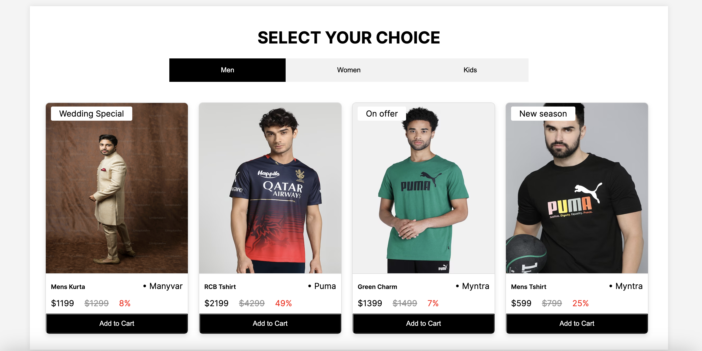
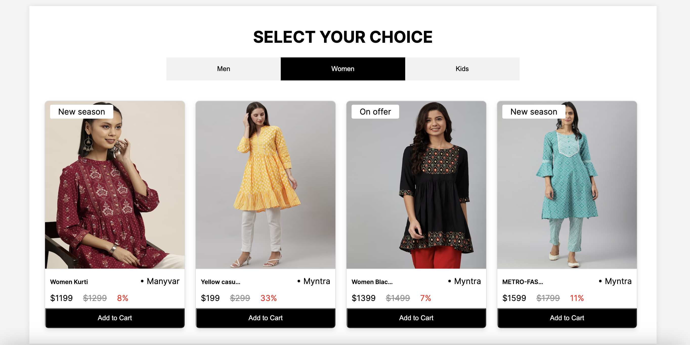
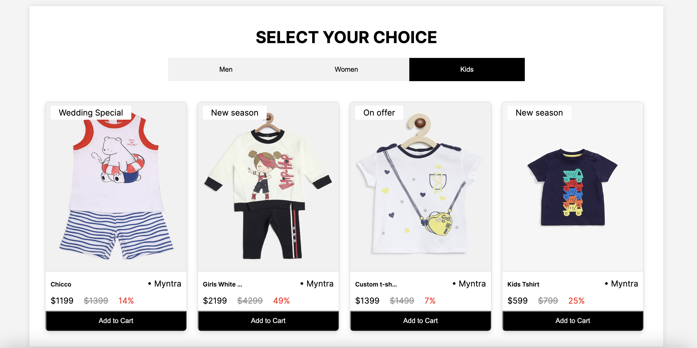

## Product Listing Component

This Product Listing Component is built using HTML, CSS, and JavaScript to create a dynamic product showcase. By clicking on the categories listed, corresponding product cards are displayed, leveraging API responses for dynamic content.

## Features:
Category-Based Display: Click on categories to reveal product cards specific to each category.

API Integration: Product card images are fetched from the API response, ensuring up-to-date visuals.

Product Information Display: Each product card showcases essential details including Product Title, Vendor Name, Price, Compare at Price, and calculated Discount in percentage.

Add to Cart Button: Though a dummy button, it enhances the visual representation of an interactive shopping experience.


## Preview

<ins>App Preview</ins>





## Live Link:-
Project is live click below
Open [https://product-listing-wine.vercel.app/](https://product-listing-wine.vercel.app/) to view it in your browser.


## Getting Started

1. **Clone or Download:**
   - If using Git, clone the repository using the following command:
     ```
     git clone https://github.com/kestsaurav21/ProductListing.git
     ```
   - Alternatively, download the code as a ZIP file and extract it.


2. **Explore the Structure:**
Take a moment to review the project structure:

        project-root/
        |-- index.html
        |-- style.css
        |-- script.js
        |-- README.md
- `index.html`: Main HTML file for your project.
- `style.css`: CSS file for styling.
- `script.js`: JavaScript file for scripting logic.
- `README.md`: Documentation for your project.
  


